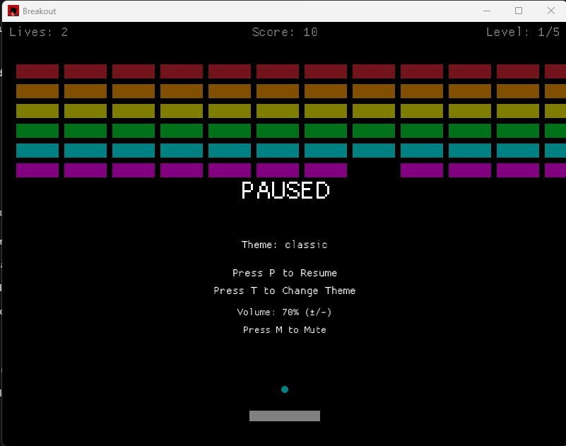

SPDX-License-Identifier: MIT

# Breakout Game - Rust + Macroquad Implementation

A feature-rich Breakout/Arkanoid game implemented in Rust using the Macroquad game engine.

## Project Structure

```
breakout/
├── Cargo.toml                    # Project dependencies and metadata
├── BREAKOUT_PRD.md              # Product requirements reference
├── README.md                     # This file
├── docs/implementation_backlog.md # Prioritized remaining work
└── src/
    ├── main.rs                  # Entry point and main game loop
    ├── constants.rs             # Game constants (screen size, speeds, colors)
    ├── types.rs                 # Core data structures (Ball, Paddle, Brick, etc)
    ├── game.rs                  # Game state management and logic
    ├── physics.rs               # Collision detection and response
    ├── level.rs                 # Level definitions and generation
    ├── ui.rs                    # Rendering and UI display
    ├── ball.rs                  # Ball-specific behavior (expandable)
    ├── paddle.rs                # Paddle-specific behavior (expandable)
    ├── brick.rs                 # Brick-specific behavior (expandable)
    ├── powerup.rs               # Power-up-specific behavior (expandable)
    │
    ├── settings.rs              # Difficulty and theme definitions
    ├── themes.rs                # 5 color theme system with palettes
    ├── achievements.rs          # Achievement tracking and management
    ├── effects.rs               # Particle effects system
    ├── audio.rs                 # Audio system for game sound events
    └── persistence.rs           # Save/load helpers for high score persistence
```

## Overview

This is a feature-rich Breakout game with persistence, advanced brick variants, and expanded arcade mechanics:

- **10 Playable Levels**
  - Levels 1-5: classic layouts
  - Levels 6-10: advanced brick mixes and higher difficulty
- **Ball Physics** with deterministic, frame-based movement
- **Collision Detection** (walls, paddle, bricks)
- **8 Power-Up / Power-Down Types:**
   - Multi-Ball: Spawn 2 additional balls
   - Paddle Extend: Increase paddle width PERMANENTLY until next level or Paddle Shrink
   - Slow Time: Reduce ball velocity by 50%
   - Laser: Fire shots from the paddle
   - Shield: Save a falling ball once
   - Bomb: Destroy a local brick cluster
   - Magnetize: Stick a ball to the paddle temporarily
   - Paddle Shrink: [POWER-DOWN] Decrease paddle width (collect Paddle Extend to reverse)
- **Advanced Brick Types:**
   - Frozen: Slows the ball on hit
   - Exploding: Triggers local chain destruction
   - Steel: Requires multiple hits
   - Regenerating: Respawns after a delay
- **Lives System** (configurable by difficulty: 2-5 lives)
- **Persistence:** High score, settings, and achievements are saved between runs
- **Game States:** Main Menu, Playing, Level Complete, Game Over, Victory
- **Difficulty Modes:** Easy, Normal, Hard with dynamic multipliers
- **5 Color Themes:** Classic, Dark, Neon, CRT, Minimalist with T-key switching
- **Particle Effects:** Brick explosions, paddle hits, power-up spawns/pickups
- **Pause/Resume:** P-key toggle with pause overlay
- **Audio System:** Procedural sound effects and looping background music
- **Achievement System:** Gameplay-triggered unlocks with persistence
- **Gamepad Support:** Keyboard and controller input paths are both implemented

## Key Features

### Physics Engine
- Deterministic ball movement (frame-based, no delta-time)
- Angle-variation on paddle bounces based on hit position
- Proper collision detection using closest-point algorithm
- Ball velocity clamping to prevent speed explosion

### Difficulty System
Selectable difficulty modes with dynamic multipliers:
| Mode | Ball Speed | Paddle Width | Lives | Power-Up Chance |
|------|-----------|--------------|-------|-----------------|
| Easy | 0.8x | 130px (+30%) | 5 | 25% |
| Normal | 1.0x | 100px | 3 | 15% |
| Hard | 1.3x | 70px (-30%) | 2 | 10% |

### Visual Themes
5 professional color schemes (cycle with T-key):
- **Classic:** Original 8-bit arcade palette
- **Dark:** Low-light gaming friendly
- **Neon:** High-contrast cyberpunk aesthetic
- **CRT:** Retro monitor scanlines and glow
- **Minimalist:** Clean, flat design

### Particle Effects
Visual feedback system:
- Brick destruction: 12-particle bursts with velocity
- Paddle hits: 8-particle collision effects
- Power-up spawns: 16-particle emission
- Power-up pickups: 20-particle celebration effect

### Pause & Settings
- **P-key pause:** Freeze gameplay while keeping particles/UI running
- **Theme switching:** Real-time theme changes with T-key
- **Difficulty switching:** D-key cycles Easy / Normal / Hard
- **Volume and music controls:** `+`, `-`, and `M`
- **Settings persistence:** Automatically save user preferences

### Achievement System
10 achievements across 3 categories:
- **Skill:** Sharpshooter, Rapid Fire, Perfect Clear, Speedrunner, Multi-Ball Master
- **Collection:** Power-Up Hoarder, Lucky Break, Time Bender
- **Exploration:** Theme Collector, Hardcore Champion

### Audio System
AudioManager with sound effects for all game events:
- **Paddle Hit:** 400Hz beep (40ms) when ball touches paddle
- **Brick Destroy:** 600Hz beep (80ms) on brick destruction
- **Power-Up Pickup:** 900Hz beep (150ms) on power-up collection
- **Level Complete:** 700Hz beep (200ms) when level cleared
- **Game Over:** 300Hz beep (300ms) on losing all lives
- **Victory:** 800Hz beep (400ms) on completing all levels

### Game Constants
- Screen: 800×600 pixels
- Ball radius: 5 pixels
- Paddle: 100 pixels wide (150 when extended, 60 when shrunk), 15 pixels tall
- Bricks: 60×20 pixels, 12×6 grid (72 per level)
- Levels: 10 total
- Power-ups: 15% base spawn chance, timed effects use frame-based durations

## Building & Running

## Windows Downloads

Prebuilt Windows builds are published on GitHub Releases:

- Portable ZIP: unzip and run `breakout.exe`
- Installer: run the setup `.exe` for shortcuts and uninstall support

Latest releases: https://github.com/rajandiappan/rusty-breakout/releases

If you just want to play on Windows, use a GitHub Release asset.
If you want to develop or test locally, use Cargo.

### Prerequisites
- Rust 1.70+ ([Install Rust](https://www.rust-lang.org/tools/install))
- Cargo (comes with Rust)

### Build
```bash
cargo build --release
```

### Run
```bash
cargo run --release
```

## Controls

| Key | Action |
|-----|--------|
| LEFT Arrow / A | Move paddle left |
| RIGHT Arrow / D | Move paddle right |
| SPACE | Start game / Play again |
| P | Pause/Resume during gameplay |
| T | Cycle through themes (5 color schemes) |
| D | Cycle difficulty |
| M | Toggle music |
| `+` / `-` | Adjust SFX volume |
| ESC | Quit to menu / Exit game |

Controller support is also available through the `gamepad` input path.

## Gameplay

1. **Main Menu:** Press SPACE to start
2. **Playing:** Control the paddle with arrow keys or gamepad input and destroy all bricks
3. **Power-ups:** Fall from destroyed bricks with difficulty-adjusted spawn chance
   - Multi-Ball, Paddle Extend, Slow Time, Laser, Shield, Bomb, Magnetize, Paddle Shrink
4. **Level Complete:** Auto-advances after 2 seconds
5. **Victory:** Complete all 10 levels to win
6. **Game Over:** Run out of lives to lose

## Code Architecture

### Main Game Loop (main.rs)
```rust
loop {
    // Input
    handle_input()
    
    // Update
    game.update()
    
    // Render
    clear_background()
    game.render()
    
    // Timing (60 FPS)
    next_frame()
}
```

### Game State Management (game.rs)
- `GameState`: Holds all game data (score, lives, balls, paddle, bricks, etc)
- `Game`: Manages game flow and state transitions
- Methods for level loading, collisions, power-ups, persistence, and rendering

### Persistence
- `persistence.rs`: File-backed high score helpers
- `settings.rs`: Serialized user preferences and theme history
- `achievements.rs`: Persistent achievement storage

### Physics (physics.rs)
- `check_ball_paddle_collision()`: Paddle bounce with angle variation
- `check_ball_brick_collision()`: Brick destruction with side detection
- `check_powerup_pickup()`: Power-up collection

### Rendering (ui.rs)
- `render_game()`: Main HUD and game objects
- `render_main_menu()`: Title screen
- `render_level_complete()`: Level completion screen
- `render_game_over()`: Game over screen
- `render_victory()`: Victory screen

## Data Structures

### Ball
```rust
struct Ball {
    x: f32, y: f32,           // Position
    vx: f32, vy: f32,         // Velocity (pixels/frame)
    radius: f32,              // Collision radius
    active: bool,             // Is ball in play?
}
```

### Paddle
```rust
struct Paddle {
    x: f32, y: f32,           // Position
    width: f32,               // Current width (changes with extend/shrink)
    height: f32,              // Height (constant)
    normal_width: f32,        // Base width (difficulty-adjusted)
    extended_width: f32,      // Width when extended (1.5x normal)
    shrunk_width: f32,        // Width when shrunk (0.6x normal)
    is_extended: bool,        // Currently extended?
    is_shrunk: bool,          // Currently shrunk?
}
```

### Brick
```rust
struct Brick {
    x: f32, y: f32,           // Position
    width: f32, height: f32,  // Dimensions
    active: bool,             // Not yet destroyed?
    color: Color,             // Display color
}
```

## Physics Details

### Ball Movement
```
x_new = x + vx
y_new = y + vy
```

### Paddle Collision with Angle Variation
```
// Reverse vertical velocity
vy_new = -abs(vy)

// Calculate normalized hit position (-1.0 to 1.0)
hit_pos = (ball_x - paddle_center) / (paddle_width / 2)

// Apply horizontal spin
vx_new = hit_pos * 2.5

// Clamp total speed to max_speed (6.0)
```

### Brick Collision Detection
Uses closest-point algorithm to determine entry side:
- If |dx| > |dy|: Horizontal entry → flip vx
- Otherwise: Vertical entry → flip vy

## Scoring

- Brick destroyed: +10 points
- Level completed: +1000 bonus points
- All 10 levels completed: +5000 bonus points
- High score is saved and displayed

## Power-Up System

### Multi-Ball (M - Gold)
- Spawns 2 additional balls at ±20° angles
- Maximum 3 balls in play
- Risk/reward mechanic

### Paddle Extend (P - Green)
- Increases paddle width to 150 pixels (1.5x normal)
- **PERMANENT effect**: Lasts until next level or until Paddle Shrink is collected
- Defensive, safety-focused
- Only one extend active at a time

### Slow Time (S - Purple)
- Reduces ball velocity to 50%
- Duration: 60 frames (1 second at 60 FPS)
- Defensive, skill-focused
- Only affects ball speed, not paddle

### Paddle Shrink (S - Red/Dark) [POWER-DOWN]
- Decreases paddle width to 60 pixels (60% of normal)
- Icon: Circle bomb (◈)
- Effect: Reduces paddle size making gameplay more challenging
- **Reversed by**: Collecting a Paddle Extend power-up
- Strategic trade-off: Risk vs. reward on power-up collection

## Collision Handling Priority

1. **Paddle** (highest priority - stops ball from falling)
2. **Walls** (side walls and top)
3. **Bricks** (lowest priority)
4. **Bottom** (game over zone)

## Performance

- Target: 60 FPS locked
- Memory usage: <50 MB
- Deterministic physics (frame-based, no delta-time variance)
- Build time: <10 seconds (with fast compiles configuration)

## Future Enhancement Ideas

Phase 1 through Phase 5 core work are largely complete. Future ideas:

- Real audio synthesis using rodio or platform-specific audio APIs
- Boss levels with special mechanics
- Mobile touch controls
- Environment hazards and moving formations
- Extra particle variants for advanced effects
- Curved paddle surface physics
- Extended level content (15+ additional levels)
- Online leaderboards and cloud sync
- Replay recording and sharing
- Competitive multiplayer modes

## Development Notes

### Adding New Features
1. **New Power-Up:** Add to `PowerUpType` enum in `types.rs`, handle in `game.rs::apply_powerup()`
2. **New Level:** Add pattern function in `level.rs::create_level_bricks()`
3. **New Rendering:** Add functions in `ui.rs`

### Testing Physics
The closest-point collision algorithm handles:
- Corner hits correctly
- Multiple simultaneous collisions (processed in priority order)
- Ball stuck in brick (allows 1-frame exit)
- Edge cases (paddle at screen edge, high velocity)

### Debug Mode
Add debug rendering by modifying `ui.rs::render_game()`:
```rust
// Draw collision boxes
draw_rectangle_lines(paddle.x, paddle.y, paddle.width, paddle.height, 2.0, YELLOW);
```

## References

- **PRD Document:** See `BREAKOUT_PRD.md` for complete specifications
- **Macroquad Docs:** https://docs.rs/macroquad/
- **Macroquad Examples:** https://github.com/not-fl3/macroquad/tree/master/examples

## Screenshots



## Quick Start

Clone and build quickly:

```bash
git clone https://github.com/rajandiappan/rusty-breakout.git
cd rusty-breakout
cargo build --release
```

Run (release):

```bash
./target/release/breakout  # Unix-like
target\\release\\breakout.exe  # Windows
```

If you want to test a debug build first:

```bash
cargo run --release
```

## Development & CI

Development work should remain quality-assured with local checks and CI.

- Local checks you can run:
- cargo check --all-targets --all-features
- cargo test --all-features -- --nocapture
- cargo build --release
- Optional quality checks:
  - cargo fmt --all -- --check
  - cargo clippy --all-targets --all-features -- -D warnings

- CI on GitHub:
  - The repository uses a GitHub Actions workflow at .github/workflows/ci.yml
  - It runs cargo check, cargo test, and a release build on push and PRs
  - Logs are available in the Actions tab for each run
- Windows release automation:
  - Tagged builds like `v0.1.0` use `.github/workflows/release.yml`
  - The release workflow builds a portable Windows zip and an installer
  - Tagged runs publish both assets to GitHub Releases
  - Manual runs can be used as packaging dry runs without publishing


## License

This is an educational project based on the classic Breakout/Arkanoid arcade games.

## Contributing

This project is designed as a learning resource. Feel free to:
- Add new level patterns
- Implement new power-ups
- Enhance physics
- Add visual effects
- Optimize performance

---

**Status:** Ready for compilation and testing with Rust 1.70+
